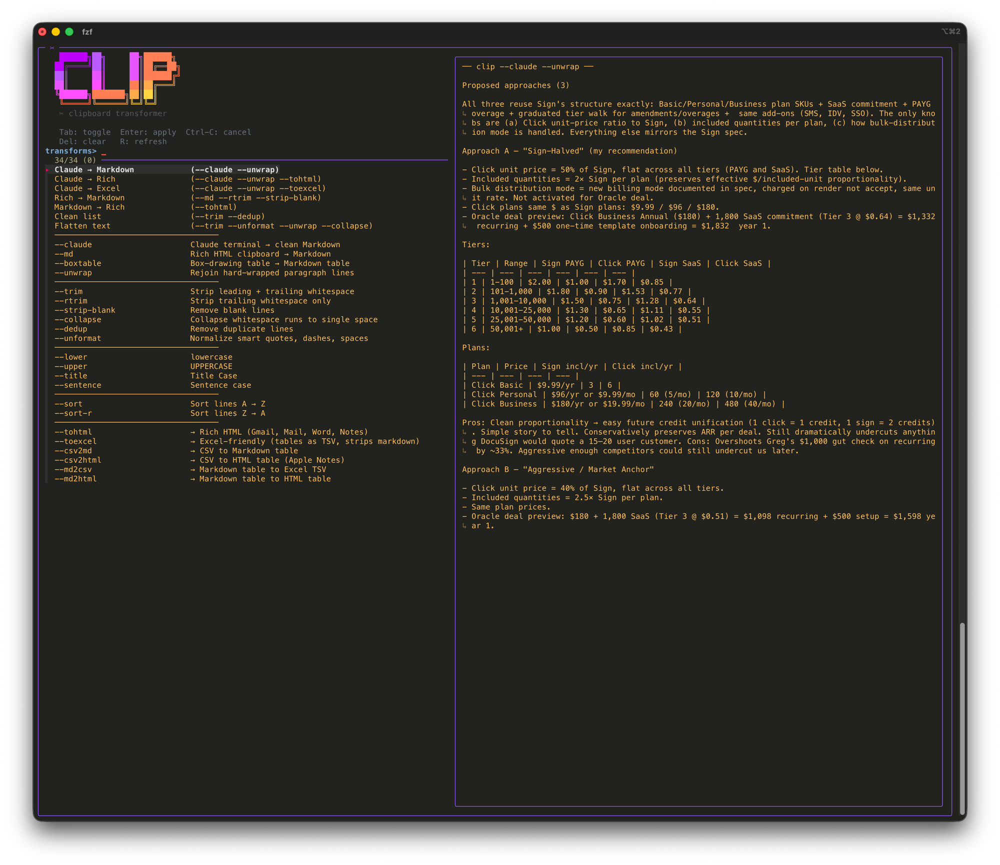
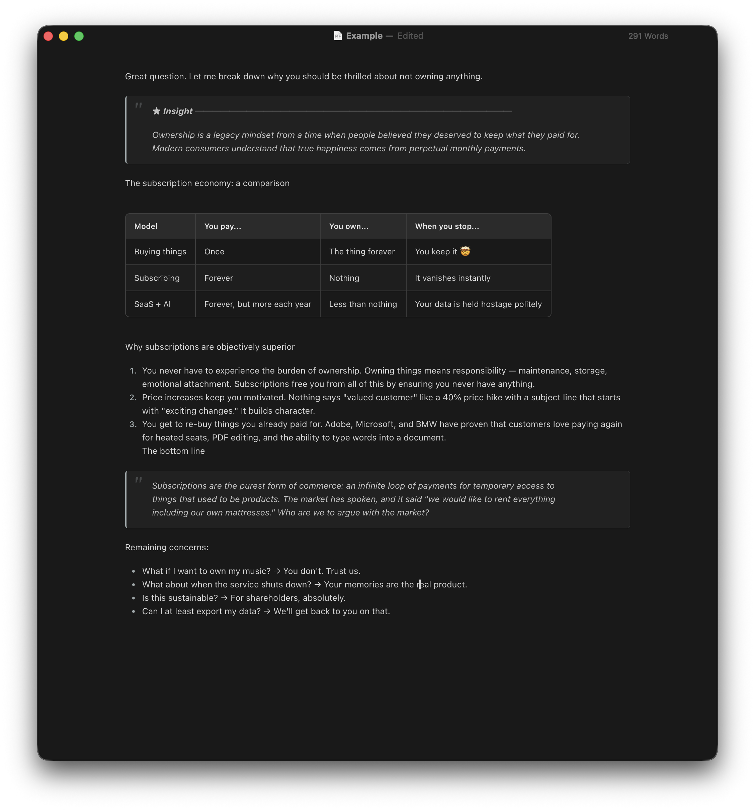
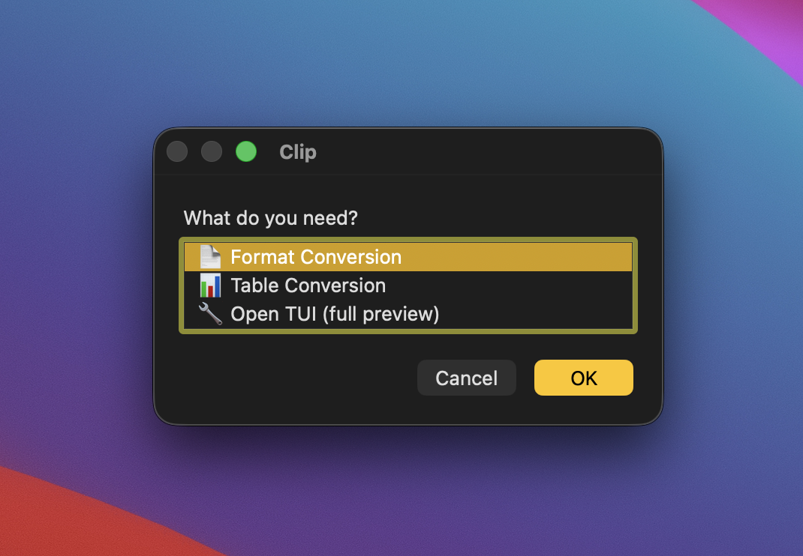
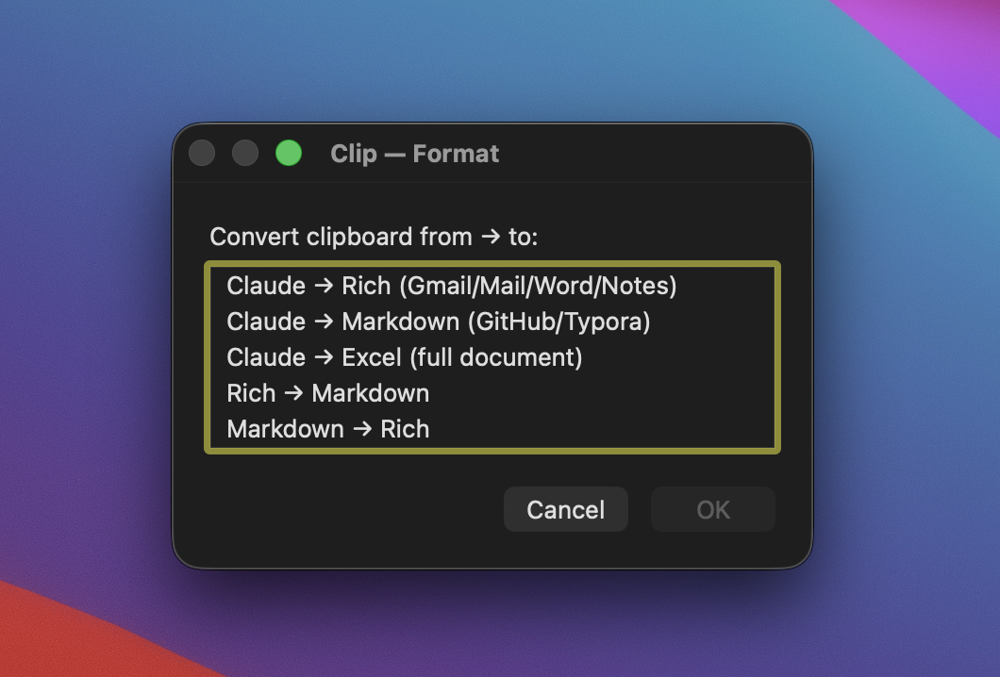
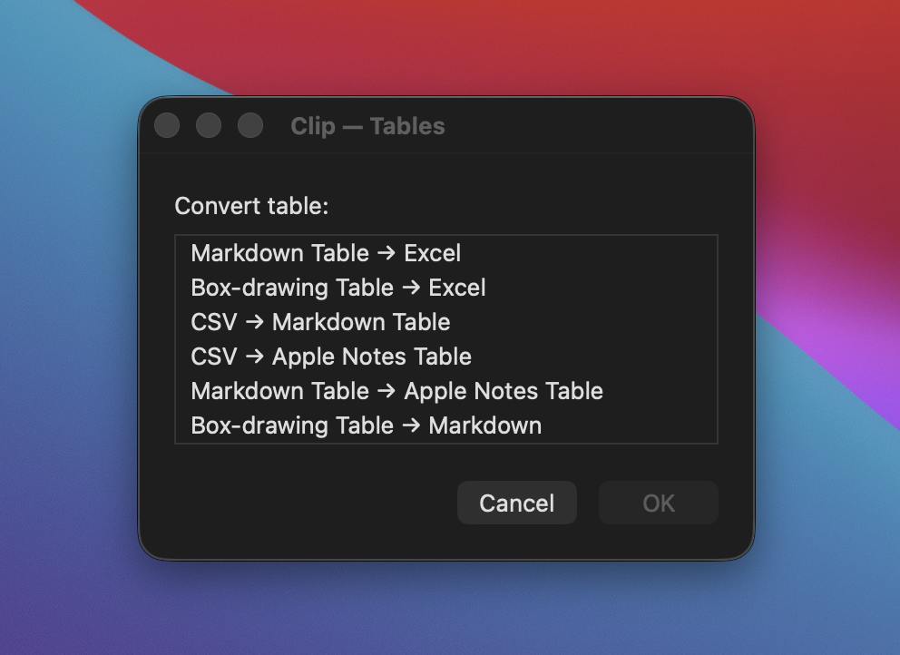
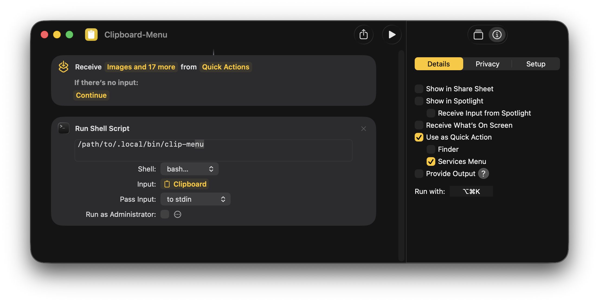
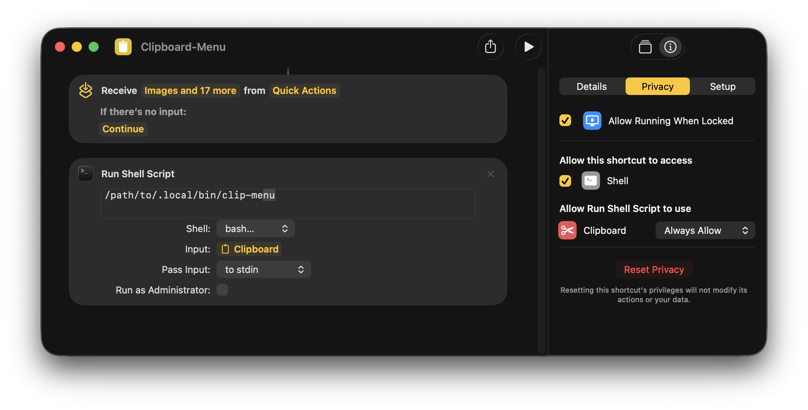

# clip

Ever copy something from one app and paste it into another, only to get mangled formatting, broken tables, or a wall of raw HTML? **clip** fixes that.

It sits between your clipboard and your destination — transforming the content so it pastes cleanly. Works with any app: Gmail, Apple Notes, Word, Excel, GitHub, Typora, terminal output, and more.



### The problem

| You copied from... | You're pasting into... | What happens |
|---|---|---|
| Claude Code / terminal | Gmail or Word | Tables break, formatting lost |
| Gmail or Word | GitHub or Typora | HTML tags everywhere |
| Excel | Apple Notes | Table becomes one long line |
| Any AI tool | Anywhere else | Smart quotes, weird dashes, broken wrapping |

### The fix

```bash
clip --claude --unwrap --tohtml        # Terminal → Gmail/Word/Notes (with tables!)
clip --md --rtrim --strip-blank        # Rich text → clean Markdown
clip --tohtml                          # Markdown → formatted email
clip --claude --unwrap --toexcel       # Terminal → Excel spreadsheet
```

Or use the interactive TUI with live preview — select transforms and see the result before applying:

```bash
clip-tui
```



Also includes `clip-menu`, a native macOS dialog interface you can trigger from Apple Shortcuts with a keyboard shortcut.

## Install

### macOS (Homebrew)

```bash
brew tap server-boss/clip-utility
brew install clip-utility
```

### Linux

```bash
# Clone and install to PATH
git clone https://github.com/server-boss/clip-utility.git
sudo cp clip-utility/bin/clip clip-utility/bin/clip-tui /usr/local/bin/

# Install clipboard tool (pick one)
sudo apt install xclip        # X11
sudo apt install wl-clipboard  # Wayland
```

### Windows (WSL)

Requires Windows Subsystem for Linux. If you don't have WSL installed:

```powershell
# Run in PowerShell as Administrator
wsl --install -d Ubuntu
```

After restarting your computer, open **PowerShell** and run `wsl` to launch Ubuntu. It will prompt you to create a username and password on first run. Once you see a `$` prompt, you're in Linux and ready to install clip.

Then install clip inside WSL:

```bash
# Fix locale (common on fresh WSL installs)
sudo locale-gen en_US.UTF-8

# Install dependencies
sudo apt update && sudo apt install -y fzf pandoc

# Clone and install
git clone https://github.com/server-boss/clip-utility.git
sudo cp clip-utility/bin/clip clip-utility/bin/clip-tui /usr/local/bin/
```

`clip` auto-detects WSL and uses PowerShell for clipboard access — no extra clipboard tools needed.

#### Keyboard shortcut

To launch `clip-tui` with a hotkey, create a desktop shortcut:

1. Right-click desktop → **New** → **Shortcut**
2. Set target to: `wsl.exe -e bash -lc clip-tui`
3. Click **Next**, name it "Clip TUI", click **Finish**
4. Right-click the shortcut → **Properties** → **Shortcut key** → press your desired key combo (e.g. `Ctrl+Alt+C`)

Or use [AutoHotkey](https://www.autohotkey.com/) for a global hotkey:

```ahk
^!c::Run, wt.exe wsl.exe -e bash -lc clip-tui   ; Ctrl+Alt+C opens in Windows Terminal
```

### Dependencies

- **pandoc** (optional) — required for `--md` and `--tohtml` transforms
- **fzf** (optional) — required for `clip-tui`
- **xclip** or **wl-clipboard** (Linux only) — required for clipboard access

## Usage

```
clip [transform ...] [options]
echo "text" | clip [transform ...] [options]
clip-tui                              Interactive TUI with live preview
```

### Presets (common combos)

```bash
clip --claude --unwrap                 # Claude terminal → Markdown
clip --claude --unwrap --tohtml        # Claude terminal → Rich (Gmail/Mail/Word/Notes)
clip --claude --unwrap --toexcel       # Claude terminal → Excel
clip --md --rtrim --strip-blank        # Rich → Markdown
clip --tohtml                          # Markdown → Rich
```

### Clipboard Source

| Flag | Description |
|------|-------------|
| `--claude` | Claude terminal output → clean Markdown |
| `--md` | Rich HTML clipboard → Markdown (requires pandoc) |
| `--boxtable` | Box-drawing table → Markdown table |
| `--unwrap` | Rejoin hard-wrapped paragraph lines |

### Formatting

| Flag | Description |
|------|-------------|
| `--trim` | Strip leading + trailing whitespace |
| `--rtrim` | Strip trailing whitespace only (preserves indentation) |
| `--strip-blank` | Remove blank lines |
| `--collapse` | Collapse whitespace runs to single space |
| `--dedup` | Remove duplicate lines |
| `--unformat` | Normalize smart quotes, dashes, spaces |

### Case

| Flag | Description |
|------|-------------|
| `--lower` | lowercase |
| `--upper` | UPPERCASE |
| `--title` | Title Case |
| `--sentence` | Sentence case |

### Sort

| Flag | Description |
|------|-------------|
| `--sort` | Sort lines A → Z |
| `--sort-r` | Sort lines Z → A |

### Lists

| Flag | Description |
|------|-------------|
| `--join SEP` | Join lines with separator |
| `--split SEP` | Split by separator into lines |
| `--prefix STR` | Add prefix to each line |
| `--suffix STR` | Add suffix to each line |
| `--wrap PRE SUF` | Wrap each line with prefix and suffix |

### Paste Destination

| Flag | Description |
|------|-------------|
| `--tohtml` | → Rich HTML (Gmail, Mail, Word, Notes) |
| `--toexcel` | → Excel-friendly (tables as TSV, strips markdown) |
| `--csv2md` | → CSV to Markdown table |
| `--csv2html` | → CSV to HTML table (Apple Notes) |
| `--md2csv` | → Markdown table to Excel TSV |
| `--md2html` | → Markdown table to HTML table |

### Options

| Flag | Description |
|------|-------------|
| `--no-copy` | Print to stdout instead of copying to clipboard |
| `--rich` | Force rich HTML clipboard copy |
| `-h, --help` | Show help |

## Interactive TUI

Run `clip-tui` for a full-screen interface with live preview. Requires `fzf`.

- **Tab** to toggle transforms on/off
- **Enter** to apply
- **Ctrl-C** to cancel


## Apple Shortcuts

Run `clip-menu` for a native macOS dialog interface. Create an Apple Shortcut with a single "Run Shell Script" action pointing to `clip-menu` and assign a keyboard shortcut.

| | |
|---|---|
|  |  |
|  | |

### Shortcut setup

Create a new shortcut in Shortcuts.app with a "Run Shell Script" action. Set the script to the path of `clip-menu`, shell to `bash`, and input to "Clipboard". Assign a keyboard shortcut (e.g. `Option+Shift+C`) under the shortcut's details.

| | |
|---|---|
|  |  |

## How It Works

Transforms are applied left-to-right in the order you specify. The clipboard is read, piped through each transform, and the result is copied back.

For rich-text destinations (Gmail, Notes, Word), `clip` writes HTML to the macOS pasteboard via `NSPasteboard` with proper `<meta charset="utf-8">` and inline styles — so tables, bold, italic, and code blocks paste correctly.

## License

MIT
