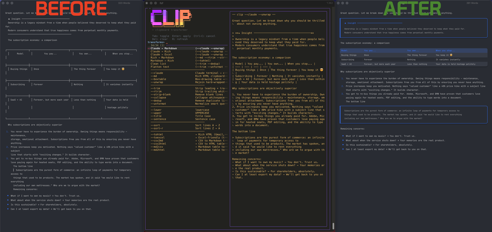
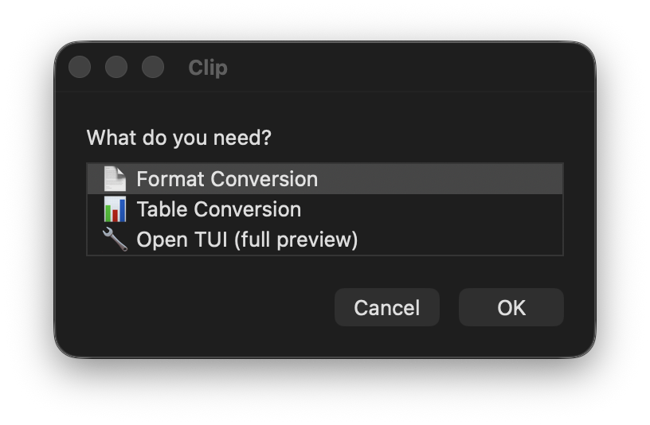
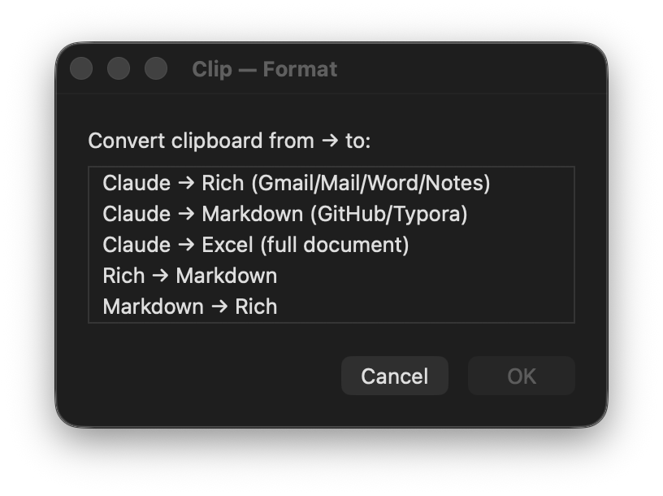
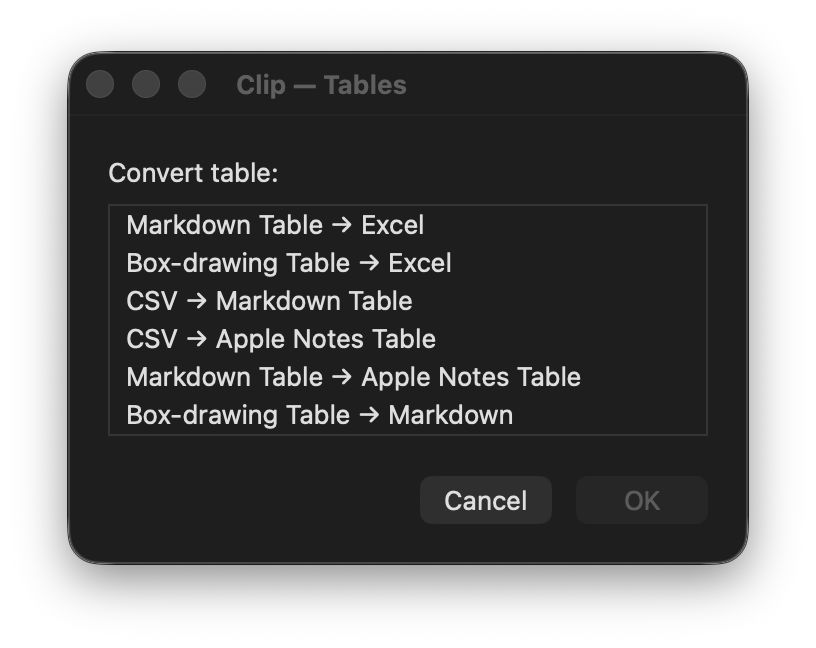
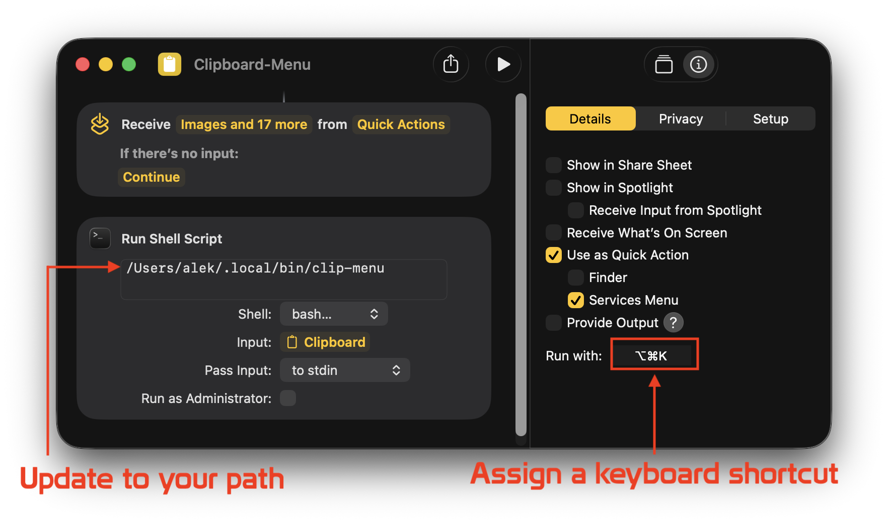

# Clip-Utility ✂︎

I got tired of copying text from one app to another, only for it to have butchered formatting, broken tables, mangled lists, or aggravating whitespace/line-breaks. Enter... `clip` ... my multi-tool that bundles a CLI with wide range of powerful clipboard tools, a live-preview TUI, and a MacOS-native popup for quick access to the tool outside of the terminal!

## The Tool(s)

### #1 Use the interactive TUI with live preview — select transforms and see the result before applying

```bash
clip-tui
```



### #2 Open a native MacOS menu from the terminal, or assign it to a keyboard shortcut using an Apple "Shortcut" — for quick access to presets without a live-preview

```bash
clip-menu
```

<p>



</p>
<p>
 
<p>

### #3 Or use the CLI directly, to customize which arguments to apply in order that they are passed:

```bash
clip
```

**Examples:**

```bash
clip --claude --unwrap --tohtml        # Terminal → Gmail/Word/Notes (with tables!)
clip --md --rtrim --strip-blank        # Rich text → clean Markdown
clip --tohtml                          # Markdown → formatted email
clip --claude --unwrap --toexcel       # Terminal → Excel spreadsheet
```

## Installation Guide for MacOS (Homebrew)

### Install Homebrew package manager

```bash
/bin/bash -c "$(curl -fsSL https://raw.githubusercontent.com/Homebrew/install/HEAD/install.sh)"
```
Apple Silicon Macs (M1, M2, M3, M4) require adding Homebrew to your system PATH to avoid "command not found" errors.  Run the following command:

```
(echo; echo 'eval "$(/opt/homebrew/bin/brew shellenv)"') >> ~/.zprofile && eval "$(/opt/homebrew/bin/brew shellenv)"   
```

### Install `clip-utility` package

```bash
brew tap server-boss/clip-utility && brew install clip-utility
```

### Install Dependencies 

**pandoc** (recommended) — required for `--md` and `--tohtml` transforms

**fzf** (recommended) — required for `clip-tui`

```bash
brew install pandoc fzf
```

### Apple-Shortcut Setup

Create a new shortcut in Shortcuts.app with a "Run Shell Script" action. 
Set the script to the path of `clip-menu`, shell to `bash`, and input to "Clipboard" as "stdin". 
Assign a keyboard shortcut (e.g. `Option+Shift+C`) under the shortcut's options.

## Full Clip CLI Argument List

### Formatting Based on Source

| Flag | Description |
|------|-------------|
| `--claude` | Claude terminal output → clean Markdown |
| `--md` | Rich HTML clipboard → Markdown (requires pandoc) |
| `--boxtable` | Box-drawing table → Markdown table |
| `--unwrap` | Rejoin hard-wrapped paragraph lines |

### General Formatting

| Flag | Description |
|------|-------------|
| `--trim` | Strip leading + trailing whitespace |
| `--rtrim` | Strip trailing whitespace only (preserves indentation) |
| `--strip-blank` | Remove blank lines |
| `--collapse` | Collapse whitespace runs to single space |
| `--dedup` | Remove duplicate lines |
| `--unformat` | Normalize smart quotes, dashes, spaces |

### Case Formatting

| Flag | Description |
|------|-------------|
| `--lower` | lowercase |
| `--upper` | UPPERCASE |
| `--title` | Title Case |
| `--sentence` | Sentence case |

### Sorting

| Flag | Description |
|------|-------------|
| `--sort` | Sort lines A → Z |
| `--sort-r` | Sort lines Z → A |

### Lists

| Flag | Description |
|------|-------------|
| `--join SEP` | Join lines with separator |
| `--split SEP` | Split by separator into lines |
| `--prefix STR` | Add prefix to each line |
| `--suffix STR` | Add suffix to each line |
| `--wrap PRE SUF` | Wrap each line with prefix and suffix |

### Formatting Based on Destination

| Flag | Description |
|------|-------------|
| `--tohtml` | → Rich HTML (Gmail, Mail, Word, Notes) |
| `--toexcel` | → Excel-friendly (tables as TSV, strips markdown) |
| `--csv2md` | → CSV to Markdown table |
| `--csv2html` | → CSV to HTML table (Apple Notes) |
| `--md2csv` | → Markdown table to Excel TSV |
| `--md2html` | → Markdown table to HTML table |

### Other Options

| Flag | Description |
|------|-------------|
| `--no-copy` | Print to stdout instead of copying to clipboard |
| `--rich` | Force rich HTML clipboard copy |
| `-h, --help` | Show help |


## Security

Clip runs entirely on your machine — no data is sent to any server or third party. All transforms are applied locally using standard Unix tools (`awk`, `sed`, `pandoc`). Clipboard content never leaves your system. The source code is short, readable bash — audit it yourself in minutes.

## License

MIT
